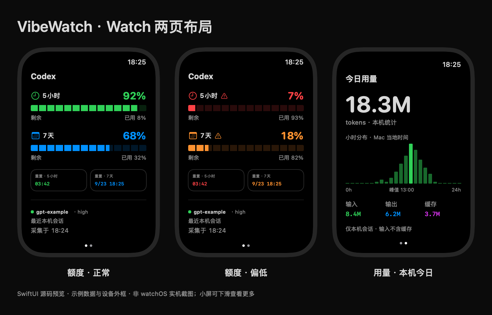
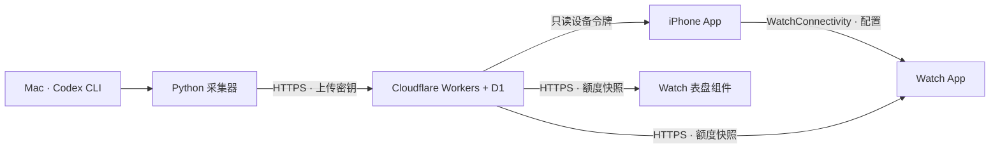

# VibeWatch

**抬腕查看 Codex 剩余额度。**

VibeWatch 将 Mac 上的 Codex 额度同步到 iPhone 与 Apple Watch，提供手表额度看板、今日用量统计，以及系统表盘上的额度组件。你可以自行部署云端、构建客户端，并用自己的 Apple 开发者账号安装。

[](LICENSE)
[](https://github.com/elliclee/vibewatch/actions/workflows/ci.yml)



*由 SwiftUI 源码渲染的布局预览，使用示例数据和示意外框；不是 watchOS 实机截图。实际运行只展示采集到的数据。*

## 功能

- **Watch 额度看板**：分段进度条、剩余与已用比例、低额度提示、重置时间及采集时间。
- **今日用量**：本机 token 总量、小时分布、输入／输出／缓存拆分，以及最近本机会话的模型信息。
- **表盘组件**：WidgetKit 矩形、圆形组件，点击进入手表详情。
- **云端同步**：Cloudflare Workers + D1，自行部署；Watch 配对后可以直接联网读取。
- **一次性配对**：iPhone 扫码或粘贴链接，通过 WatchConnectivity 向手表传递只读连接配置。
- **真实状态**：保留缺失窗口、未知比例与过期提示；不会将缺少 5 小时限制误报为满额或无限。

当前默认工程包含 **iPhone App、iPhone 小组件、Watch App、Watch 表盘组件**。手机支持桌面小号／中号与锁屏矩形／圆形组件，升级后先打开一次主 App 完成配对迁移。见 [手机小组件](docs/PHONE-WIDGETS.md)。

手机小组件排版预览见 [样式说明](docs/PHONE-WIDGETS.md)。

## 工作方式



额度来自 `codex app-server` 的 `account/rateLimits/read`。可选用量统计在 Mac 本地汇总 Codex 会话中的计数事件；上传内容不包含对话正文、会话 ID、文件路径或 Codex 登录凭据。

每套部署面向一个使用者及其当前 Codex 账号。仓库不提供公共额度服务，也不包含开发者证书、上传密钥或预配置设备令牌。

## 开始使用

### 环境要求

| 环境 | 要求 |
| --- | --- |
| Mac | 可运行 Xcode 的 macOS，Python 3.10+ |
| Apple 工具链 | Xcode、命令行工具、iOS / watchOS 平台支持、XcodeGen |
| 设备 | iOS 17+ 的 iPhone、watchOS 10+ 的已配对 Apple Watch |
| 开发者账号 | 自己的 Apple Developer Program 账号，用于 App Groups、真机签名或 TestFlight |
| 云端 | Cloudflare 账号及 Workers / D1，Node.js 22+、npm |
| 数据源 | 已登录且能够查询额度的 Codex CLI |

当前验证基线为 Xcode 27 SDK、Codex CLI 0.154.0；最低系统版本的全面实机兼容性尚未验证。Codex 接口变化可能需要更新采集器。

### 1. 克隆并安装依赖

```sh
git clone https://github.com/elliclee/vibewatch.git
cd vibewatch
brew install xcodegen
npm --prefix cloud ci
```

### 2. 部署自己的云端

复制模板为 `cloud/wrangler.local.jsonc`，登录 Cloudflare、创建 D1，填入自己的数据库 ID，应用迁移并配置随机 `UPLOAD_TOKEN`，然后部署。

完整命令见 **[部署与首次配对](docs/SETUP.md)**。模板中的数据库 ID 是占位符，不能直接用于生产部署。

### 3. 构建自己的 App

```sh
# 换成自己的唯一前缀和 10 位 Apple Team ID
python3 scripts/configure_apple.py \
  --prefix com.example.vibewatch --team ABCDE12345
xcodegen generate --spec apple/project.local.yml
open apple/VibeWatch.xcodeproj
```

在开发者门户注册对应标识，并为 **四个 App ID** 关联 `group.<你的前缀>.shared`。在 Xcode 选择自己的团队及真实 iPhone 运行；完整签名与安装流程见 **[Apple 构建指南](docs/BUILDING.md)**。

### 4. 配置采集并配对

```sh
python3 agent/vibewatch.py init    # 输入自己的 HTTPS 根地址和上传密钥
python3 agent/vibewatch.py probe   # 验证 Codex 额度接口
python3 agent/vibewatch.py once    # 首次上传
python3 agent/vibewatch.py pair    # 生成 10 分钟有效的一次性配对码
open "$HOME/Library/Application Support/VibeWatch/pairing.html"
```

iPhone 扫码并确认服务器，打开 Watch App 接收配置。需要持续采集时安装登录任务：

```sh
python3 agent/install_launchd.py
# 停止并移除登录任务，保留私有配置：
python3 agent/install_launchd.py --uninstall
```

用量统计默认关闭。需要第二页数据时，在 Mac 私有配置中设置 `"includeLocalUsage": true`，然后重启采集任务。详见 [用量统计口径](docs/WATCH-DASHBOARD.md)。

## 项目结构

```text
agent/                 Python 标准库采集器、配对工具、launchd 安装器
  tests/               额度归一化与本机 token 汇总测试
apple/
  iPhone/              扫码配对、连接管理与额度详情
  Watch/               手表入口与横向分页
  Widgets/             Watch 表盘组件
  Shared/              协议模型、存储、HTTP、时间线及 SwiftUI 视图
  PhoneWidgets/        iPhone 桌面与锁屏小组件
  Tests/               Swift 模型测试
  IntegrationTests/    Apple 客户端与 HTTP 集成测试
  project.yml          默认四目标 XcodeGen 工程源
cloud/
  src/                 Workers API、鉴权与快照校验
  migrations/          D1 数据库迁移
  test/                API、用量校验和 HTTP 测试服务
contracts/             v1 协议说明与虚构样例
scripts/               工程配置、构建、验证、布局预览工具
docs/                  部署、架构、验证和开发说明
```

## 开发与验证

```sh
python3 -m unittest discover -s agent/tests
python3 -m unittest discover -s scripts/tests
npm --prefix cloud run typecheck
npm --prefix cloud test
swift test --package-path apple
```

Apple 客户端测试、无签名编译与本地 Worker 测试见 [开发指南](docs/DEVELOPMENT.md)。CI 覆盖 Python、云端和 Swift 模型；签名、WatchConnectivity、系统组件调度需要 Apple 设备验证。

## 边界与数据安全

- Mac 默认每 120 秒采样。休眠、关机或离线后不会继续更新；超过 10 分钟标记过期。
- WidgetKit 刷新由系统调度，不能保证固定分钟级刷新。重置倒计时归零不代表额度已恢复。
- 今日用量仅统计这台 Mac 可读取的本地会话，不能代表账号跨设备总用量或官方账单。输入栏排除了缓存，三栏可直接相加。
- Watch 表盘组件嵌入系统表盘，不是替换系统时间界面的自定义表盘。
- 上传权限与读取权限分离；云端仅存储设备令牌的哈希。当前不包含多用户管理、APNs 推送或提醒通知。

隐私与凭据处理见 [安全说明](SECURITY.md)。

## 文档

| 文档 | 内容 |
| --- | --- |
| [部署与配对](docs/SETUP.md) | 自建云端、Mac 配置、后台运行与排障 |
| [Apple 构建](docs/BUILDING.md) | Bundle ID、App Group、Xcode 真机安装 |
| [开发指南](docs/DEVELOPMENT.md) | 本地开发、测试与布局预览 |
| [架构与协议](docs/ARCHITECTURE.md) | 数据流、存储、同步边界 |
| [HTTP 协议](contracts/README.md) | 字段、鉴权与错误语义 |
| [TestFlight](docs/TESTFLIGHT.md) | 使用自己的账号发布测试版 |
| [路线图](docs/PLAN.md) | 当前状态与未完成项目 |
| [验证记录](docs/VALIDATION.md) | 已验证内容和实机限制 |

## 贡献与许可

欢迎提交 Issue 和 Pull Request，开始前请阅读 [贡献指南](CONTRIBUTING.md)。项目采用 [MIT License](LICENSE)。

VibeWatch 是独立项目，与 OpenAI、Apple 或 Cloudflare 无隶属关系。
