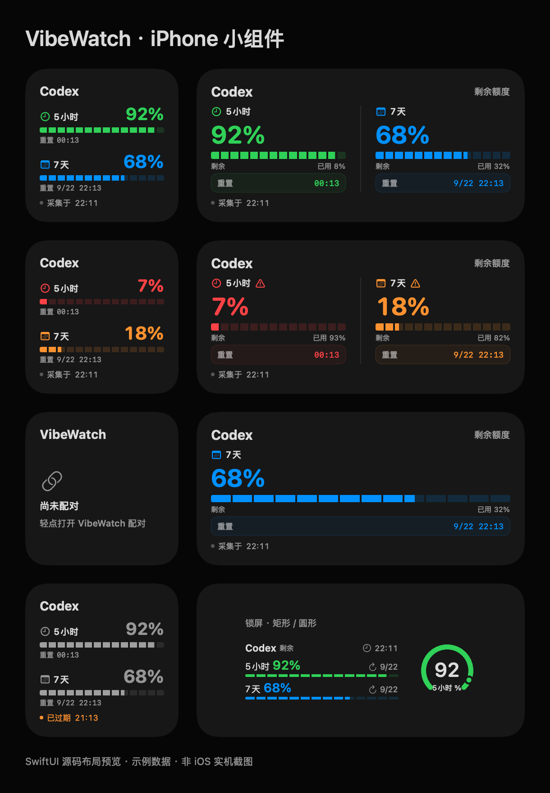

# iPhone 桌面与锁屏小组件

从 build 9 起，默认工程包含手机小组件：桌面小号／中号、锁屏矩形／圆形。显示真实额度和采集状态，跟随 App 中选择的额度类型。点击组件打开主 App 刷新。

## 更新与添加

1. 更新 TestFlight 后，先打开一次 iPhone 上的 VibeWatch，等待原有配对和额度出现。
2. 桌面长按空白处，进入添加小组件，搜索 VibeWatch，选择小号或中号。
3. 锁屏长按并自定，在小组件区域选择 VibeWatch 的矩形或圆形组件。

首次升级会将旧版私有 Keychain 配对、偏好与缓存迁入共享存储；成功写入后才清理旧配置。已有共享配对不被旧配置覆盖，断开后不会恢复旧凭据。无需主动重新配对或删除旧 App。

## 签名与数据

四个目标均需关联自己的 App Group；主 App 同时保留原私有 Keychain 组用于读取旧凭据。组件不执行迁移，也不读取旧私有配置。

云端读取、缓存隔离、缺失窗口和过期语义与 Watch 保持一致。无网络时显示缓存及其真实采集时间。WidgetKit 决定后台刷新时机，不保证立即或固定分钟级更新。

工程唯一来源为 apple/project.yml；原四目标实验配置已合并。预览脚本 scripts/render_phone_widget_preview.swift 使用虚构数据，不等同于系统实机截图。

## Watch 风格排版（build 10）

小号上下双行，中号双列大数字；采用与 Watch 相同的绿色/蓝色、低额度红色/橙色和分段额度条。中号增加重置时间卡片，小号保留紧凑重置行。浅色使用更深的颜色保证可读性，过期数据置灰并保留文字提示。锁屏矩形复用分段条，圆形保留适合小尺寸的仪表。

重置显示绝对时间，避免时间线未刷新期间展示静止的相对倒计时。锁屏的最终色彩由系统渲染模式决定。

源码预览（示例数据，非实机截图）：

[查看浅色预览](assets/phone-widgets-light.png)。build 10 已包含此次排版优化。

## 今日 tokens（build 11）

桌面小号、中号及手机锁屏矩形同时显示本机今日消耗总 tokens（输入、缓存与输出之和，缓存不重复计算），圆形保留单窗口额度仪表。数据来自 Mac 的可选本机汇总，不代表账号所有设备或当前 bucket 独占用量。

没有统计时显示 —，部分记录带“部分”提示；跨过 Mac 当地统计日边界后显示“本机上次”。时间线预排日界线切换，旧快照不会继续标成今日；数据过期仍保留提示。TestFlight 0.1.0（11）已包含此项，更新后打开一次主 App 以刷新共享缓存。
